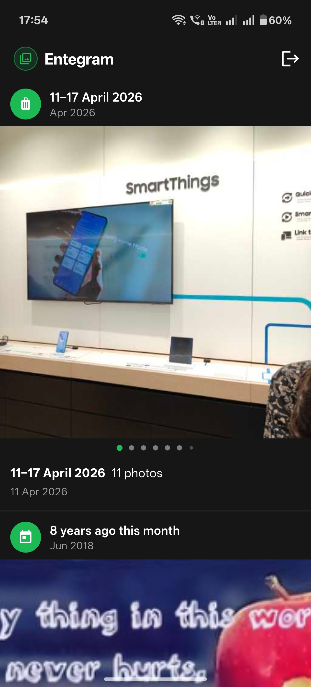
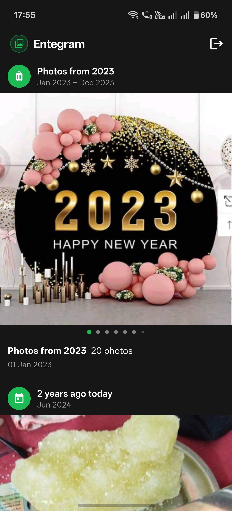
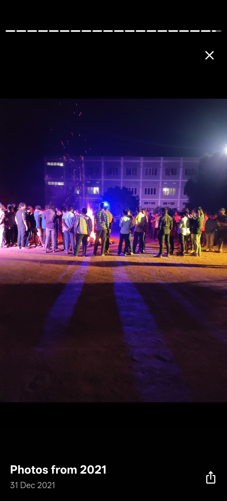

# Entegram

An Instagram-style **memories feed** and **stories viewer** for your [Ente Photos](https://ente.io) library — people, trips, "on this day", flashbacks, seasons and more, generated **on-device** from your end-to-end-encrypted photos.

> **A personal fan-boy project — not affiliated with Ente.** Entegram talks to the same API your official Ente Photos app uses, with your own account. Your password and keys never leave your device; all decryption happens locally. Works with both **ente.io** and **self-hosted** servers.

---

## Screenshots

| Memories feed | Year memory | Story viewer |
|:---:|:---:|:---:|
|  |  |  |
| Infinite, reshuffled feed of trips, people and look-backs | Per-year and seasonal recaps work without ML | Tap-to-advance full-screen playback with per-slide progress |

---

## What it does

| Feature | Detail |
|---|---|
| **Infinite memories feed** | A never-ending, Instagram-style feed of your memories. Kinds are interleaved and reshuffled with a fresh seed each launch, so the feed feels different every time you open it. |
| **Stories** | Tap a bubble at the top for full-screen story playback — per-slide progress bar, tap-to-advance, video autoplay, and swipe between stories. |
| **People memories** | "You and Alex", spotlights and "last time with…" built from **co-occurrence** of face clusters (only photos where people actually appear together), so titles match the faces on screen. Per-face name chips overlay each slide. |
| **Trips** | GPS-clustered trips with home detection and geo-temporal grouping, titled with the date range. |
| **On this day & flashbacks** | "On this day", "A year ago this month", and recent-window memories. |
| **Seasons & year summaries** | Summer/winter and per-year recaps for a long-tail of memories even on accounts without ML. |
| **Works without ML** | People memories need ML enabled on your Ente account, but everything else (trips, on-this-day, seasons, years, recents) works on **ML-disabled** accounts too. |
| **Zoomable viewer** | Pinch-to-zoom in the full-screen viewer. Slides open instantly from the cached thumbnail and **seamlessly swap to full resolution at the same zoom position** — no flash, no reset. |
| **Self-hosted friendly** | Thumbnails/originals are fetched from Ente's CDN workers on production, and **directly from your server** on self-hosted instances — no CDN dependency. |
| **End-to-end encryption** | SRP login + Argon2id key derivation; file keys and ML data decrypted in an on-device crypto isolate using [Ente's flutter_sodium fork](https://github.com/ente-io/flutter_sodium). |
| **2FA** | TOTP two-factor authentication is supported at sign-in. |
| **Share & sign out** | Share any photo via the system share sheet. One-tap sign out wipes the local Isar DB so no decrypted data lingers. |

---

## Getting started

### Prerequisites

- [Flutter SDK](https://docs.flutter.dev/get-started/install) **≥ 3.12**
- An [Ente Photos](https://ente.io) account (free tier works), or a self-hosted [Ente server](https://github.com/ente-io/ente)
- Android (tested) or iOS — other platforms may build but aren't actively supported

### Build & run

```bash
# 1. Clone
git clone https://github.com/RamNikhileshNunna/entegram.git
cd entegram

# 2. Install dependencies
flutter pub get

# 3. Generate Isar schema files (only needed after model changes)
dart run build_runner build --delete-conflicting-outputs

# 4. Run on a connected device / emulator
flutter run
```

### Sign in

Use your normal Ente email and password (plus a TOTP code if you have 2FA enabled). The app **never stores your password** — it derives your master key locally with Argon2id, exactly the way the official app does, then discards the password.

### Self-hosted server

Tap the **Entegram logo on the login screen 7 times** to open the server dialog, then enter your server URL (e.g. `http://192.168.1.10:8080`). "Reset to default" returns to ente.io. On self-hosted instances media is fetched directly from your server, so the CDN workers are never used.

---

## Architecture

```
lib/src/
├── auth/          Login, SRP key derivation, TOTP
├── crypto/        libsodium wrapper + on-device crypto isolate
├── db/            Isar models — EnteFile, EnteCollection, Person, MemoryCluster
├── media/         ThumbnailService, FullResService (concurrency + retry + circuit breaker)
├── memories/      MemoryMapper — builds MemoryCluster rows from synced files & ML data
├── network/       EnteApi (Dio REST client; CDN-worker vs. direct fetch)
├── sync/          SyncController, per-collection sinceTime cursors, ML data fetch
└── ui/
    ├── feed_screen.dart       Infinite feed with pool/display recycling + shuffle
    ├── login_screen.dart
    └── widgets/
        ├── stories_bar.dart      Horizontal story bubbles
        ├── story_viewer.dart     Full-screen story player
        ├── memory_card.dart      Feed card (green page dots, overlay chips)
        ├── fullscreen_viewer.dart Zoomable viewer with seamless thumb→original swap
        ├── person_chips.dart     Per-face name chips
        └── thumbnail_image.dart
```

State is managed with **Riverpod 3.x**. The DB layer is **Isar Community** — providers stream live from the DB, so the feed updates automatically as sync pages and memories arrive.

---

## How it works

1. **Sync.** On launch, Entegram fetches your collections, then pages through each owned collection's diff (advancing a per-collection `sinceTime` cursor), then persons and ML data. Background sync continues paging after the first screen is interactive so startup stays snappy.
2. **Decrypt locally.** File keys, thumbnails, originals and ML embeddings are decrypted in an on-device crypto isolate. Nothing is sent anywhere except the authenticated requests to your own Ente server.
3. **Build memories.** `MemoryMapper` turns synced files + face/CLIP ML data into `MemoryCluster` rows — people co-occurrence, spotlights, last-time, trips, on-this-day, flashbacks, seasons, year summaries and recents.
4. **Feed.** The feed interleaves memory kinds and reshuffles them with a per-launch seed, recycling display items as new memories stream in so it scrolls forever.

---

## Privacy & security

- **Read-only.** Entegram only reads from your library; it never modifies or deletes your photos.
- **Local decryption.** All crypto happens on-device in an isolate; keys never leave it.
- **No password storage.** Your password is used once to derive the master key, then discarded.
- **Same API as the official app.** No extra scopes, no third-party servers. Sign out wipes the local DB.

The Ente API is **not officially documented for third-party use** and may change without notice. Review the source before trusting it with your account.

---

## Disclaimer

This is an independent personal fan-boy project. It is **not** endorsed by or affiliated with Ente Technologies. Use at your own risk.

---

⭐ **If you like this project, please give it a star** — it really makes my day and helps others find it.
